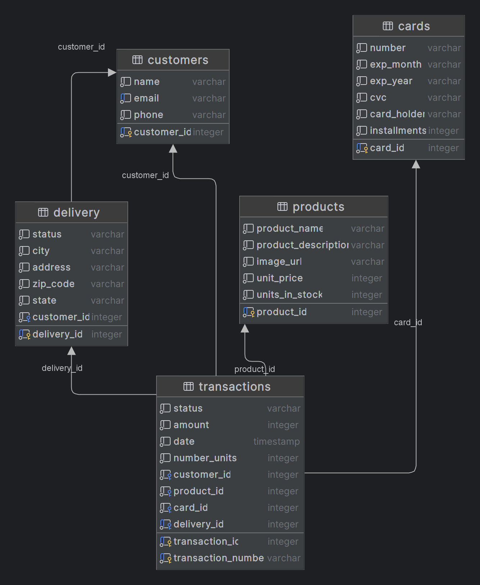

# Backend Developer Challenge

### Description

This challenge is designed to test your ability to consume an API, process the data, and return it in a different
format. You will demonstrate your skills in backend development, focusing on creating a well-structured, maintainable,
and testable codebase.

[preview online](https://backend.audiotranscription.cc/api-docs)

## Project Structure

The project structure has been set up for you. Below is an overview of the folders and their purposes:

```
├───database
├───postman
├───src
│   ├───core
│   │   ├───application
│   │   │   └───services
│   │   ├───domain
│   │   │   ├───entities
│   │   │   ├───ports
│   │   │   │   ├───inbound
│   │   │   │   └───outbound
│   │   │   └───services
│   │   └───shared
│   │       ├───dto
│   │       ├───error
│   │       └───types
│   └───infraestructure
│       ├───adapters
│       │   ├───domain
│       │   └───mapper
│       ├───http-server
│       │   ├───controllers
│       │   ├───exception-filters
│       │   ├───model
│       │   └───utils
│       ├───payment
│       │   └───wompi
│       │       ├───dto
│       │       ├───entities
│       │       ├───ports
│       │       │   ├───inbound
│       │       │   └───outbound
│       │       ├───services
│       │       └───shared
│       │           └───response
│       ├───postgress
│       │   ├───entities
│       │   ├───factories
│       │   ├───provider
│       │   ├───seeders
│       │   └───service
│       └───shared
│           └───config
└───test
```

## Folder Explanation

- **database**: Contains database configurations and scripts.
- **postman**: Contains Postman collections for API testing.
- **src**: Main source folder.
    - **core**: Contains the core application logic.
        - **application**: Contains application services.
        - **domain**: Contains domain entities, ports, and services.
            - **entities**: Domain entities such as `Product`, `Transaction`, etc.
            - **ports**: Interfaces for inbound and outbound communication.
            - **services**: Domain services implementing business logic.
        - **shared**: Shared resources across the core.
            - **dto**: Data Transfer Objects for data encapsulation.
            - **error**: Custom error classes.
            - **types**: Shared types and interfaces.
    - **infrastructure**: Contains infrastructure-related code.
        - **adapters**: Adapters for integrating with the domain layer.
        - **http-server**: Contains controllers, exception filters, models, and utilities for the HTTP server.
        - **payment**: Contains integration with the Wompi payment API.
            - **dto**: Data Transfer Objects specific to Wompi.
            - **entities**: Wompi-specific entities.
            - **ports**: Interfaces for Wompi integration.
            - **services**: Services for interacting with the Wompi API.
            - **shared**: Shared response handling for Wompi.
        - **postgres**: PostgreSQL-related code.
            - **entities**: Database entities.
            - **factories**: Factories for creating database entities.
            - **provider**: Database provider configuration.
            - **seeders**: Database seeder scripts.
            - **service**: Database services.
        - **shared**: Shared infrastructure code.
            - **config**: Configuration files and settings.
- **test**: Contains test cases and test-related configurations.

## Model DataBase


## Installation

1. Clone the repository: 
```sh
git clone https://github.com/Allrivenjs/nestjs-hexagonal.git
```
2. Navigate to the project directory: 
```sh 
cd nestjs-hexagonal/backend
```
3. Install dependencies: 
```sh 
npm install 
```
4.Create a `.env` file in the root directory and add the following environment variables: 
```sh 
cat .env.example .env
```
5. Start the development server: 
```bash 
  npm run start:dev
```

## API Documentation
You can find the API documentation [here](https://documenter.getpostman.com/view/16480692/2sA3rwMuDJ).

To test the API endpoints, you can import the Postman collection located in the postman folder.

## Testing
To run the tests, use the following command:

```sh 
 npm run test
```

Test e2e with jest and supertest
```sh
npm run test:e2e
```

## Contact 
If you have any questions or need support, please contact Jaime Ruiz.

